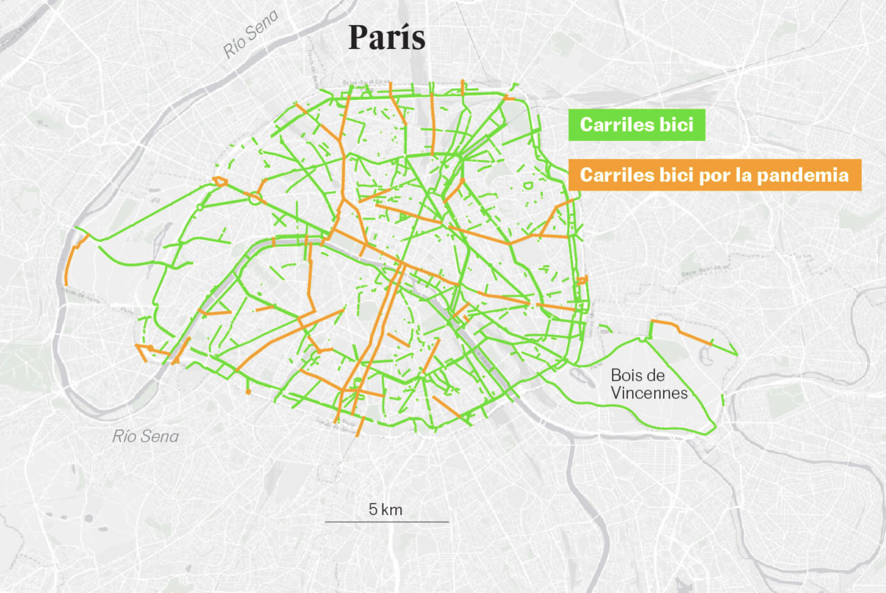

# EJERCICIO 2
La infografía que he elegido pertenece a un [reportaje de _El País_](https://elpais.com/clima-y-medio-ambiente/2020-10-27/carriles-bici-la-respuesta-de-las-ciudades-ante-la-pandemia.html?prm=ep-app-cabecera) sobre carriles bici en ciudades europeas. Con ayuda de varias infografías, se compara el número de kilómetros de carril bici en diferentes ciudades, tanto europeas como españolas. Además, se ha tenido en cuenta la pandemia, como un factor que ha impulsado la construcción de más carriles bici por parte de algunas administraciones locales. Las ampliaciones aparecen en color naranja. Así, por ejemplo, vemos que en París la ampliación ha sido considerable. 

 

En España, el caso de Madrid es particularmente llamativo, por la ausencia casi total de carriles bici en el centro de la ciudad.

 
