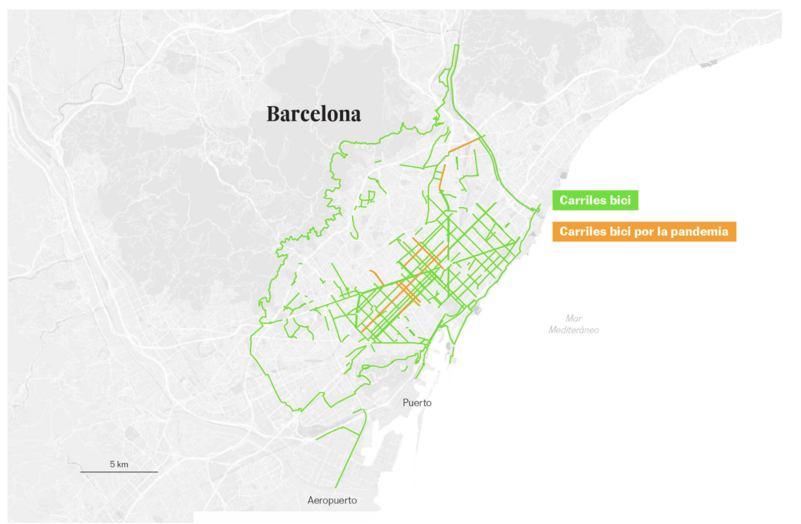

# EJERCICIO 2
La infografía que he elegido pertenece a un [reportaje de _El País_](https://elpais.com/clima-y-medio-ambiente/2020-10-27/carriles-bici-la-respuesta-de-las-ciudades-ante-la-pandemia.html?prm=ep-app-cabecera) sobre carriles bici en ciudades europeas. Con ayuda de varias infografías, se compara el número de kilómetros de carril bici en diferentes ciudades, tanto europeas como españolas. Además, se ha tenido en cuenta la pandemia, como un factor que ha impulsado la construcción de más carriles bici por parte de algunas administraciones locales. Las ampliaciones aparecen en color naranja. Así, por ejemplo, vemos que en París esta ampliación ha sido considerable. 

 

De las ciudades españolas, Barcelona es la que ha ampliado de manera más sustancial su red de carriles bici durante la pandemia, como se desprende del siguiente mapa y los tramos pintados de naranja.

En España, el caso de Madrid es particularmente llamativo, por la ausencia casi total de carriles bici en el centro de la ciudad.

 

Más adelante, se muestran todos los mapas conjuntamente, con el objetivo de ofrecer una comparación visual entre las ciudades en cuanto al número y la calidad de sus carriles bici. 

 
Al final del artículo, se incluyen varios mapas en los que se detallan los tramos conflictivos de la red de carriles bici españoles, marcados en negro. Además, se indica con flechas el tipo de conflicto que presenta cada uno de los tramos. 

En cuanto al aspecto técnico de las infografías, no me ha sido posible determinar la procedencia de los mapas, si pertenece a alguna aplicación de terceros o si es de elaboración propia. Tampoco he podido averiguar con qué programa o software se han hecho las infografías, puesto que al pulsar ⌘-Opción-U (en Mac) no aparece el código fuente. En cualquier caso, la infografía no parece muy compleja, por lo que podría haber sido elaborada con cualquier herramienta de personalización de mapas, disponible en abierto o privada.
      
